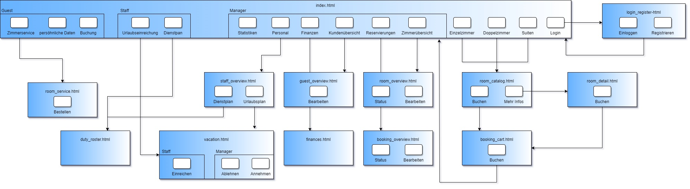
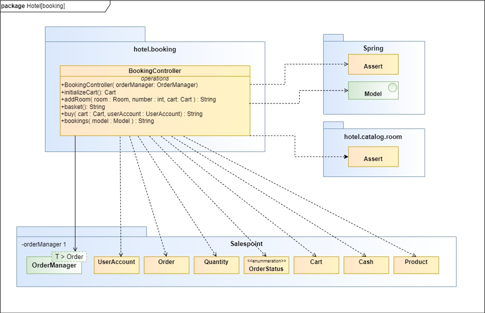

:toc:
:toclevels: 3
:toc-title:
:toc-placement!:
:sectanchors:
:numbered:

[options="header"]
[cols="1, 3, 3"]
|===
|Version | Bearbeitungsdatum   | Autor 
|1.0  |unbekannt  |unbekannt
|2.0  |08.11.2021 |Johannes Pforr
|2.1  |09.11.2021 |Eric Müller
|2.2  |13.11.2021 |Johannes Pforr, Eric Müller
|2.3  |14.11.2021 |Eric Müller, Johannes Pforr
|2.4  |15.11.2021 |Eric Müller
|===

= Entwicklerdokumentation

== Inhaltsverzeichnis
toc::[]

== Einführung und Ziele
=== Aufgabenstellung

Für ein Hotel, welches demnächst fertig gestellt wird, ist eine Software zu entwickeln, die das
Personal bei der täglichen Arbeit unterstützt. Im Vordergrund steht dabei die
Zimmerverwaltung und -reservierung. Darüber hinaus sind andere Aufgabenbereiche
abzudecken.

Das Hotel verfügt über zahlreiche Einzel- und Doppelzimmer. Diese unterscheiden sich
hinsichtlich ihrer Größe, Ausstattung und nicht zuletzt im Preis. Des weiteren bietet das Haus
seinen Gästen verschiedene Suiten mit unterschiedlicher Anzahl an Zimmern. Ebenso wie bei
den Einzel- und Doppelzimmern gibt es auch hier Suiten mit unterschiedlicher Größe und
Ausstattung. Es sei noch anzumerken, dass sich sowohl der Preis als auch die Ausstattung
der Zimmer und Suiten jederzeit ändern kann. Das Programm sollte so flexibel sein, dass es
möglichst einfach an die neuen Gegebenheiten angepasst werden kann.

Die Zimmer-Reservierung erfolgt wahlweise telefonisch oder über das Internet. Dabei ist der
prinzipielle Ablauf der Bestellung in beiden Fällen gleich. Nachdem der Gast seine Wünsche
(Anzahl Zimmer, Anzahl Betten, Ausstattung, Zeitraum, etc.) geäußert hat, soll das Programm
alle freien und den genannten Kriterien entsprechenden Zimmer auflisten. Für den Fall, dass
die gewünschte Kombination in dem angegeben Zeitraum nicht verfügbar ist, soll das System
mögliche Alternativen vorschlagen. Pro Bestellung können auch mehrere Zimmer/Suiten
reserviert werden.

Der Preis pro Übernachtung hängt zum einen von der Größe und Ausstattung der Zimmer und
zum anderen von der gewünschten Verpflegung (Frühstück, Halb- oder Vollpension) ab.
Zusätzlich wird je nach Saison ein Aufschlag berechnet.

Reservierungen können jederzeit storniert werden, jedoch wird hierfür eine Gebühr berechnet.
Hierzu müssen bereits während des Bestellvorgangs einige Daten der Gäste, wie z.B. Name
und Kreditkarten-Daten, gespeichert werden. Die Belegung bzw. Reservierung der einzelnen
Zimmer soll zu jedem Zeitpunkt abrufbar sein.

Bei der Anreise der Gäste werden ihre persönlichen Daten vervollständigt. Gäste, die nicht
anreisen, wird der volle Betrag in Rechnung gestellt. Bei Abreise erhält jeder Gast eine
detaillierte Rechnung über Kosten der Übernachtung, Verpflegung, und Zimmerservice.

Die belegten Zimmer werden täglich gereinigt. Dafür sind die Reinigungskräfte verantwortlich, die jeden Tag aufs Neue den
entsprechenden Zimmern zugeteilt werden müssen. Diese Aufgabe ist nicht immer trivial, da
die Reinigung je nach Größe der Zimmer unterschiedlich viel Zeit beansprucht. Hinzu kommt,
dass am Tag der Abreise eine Endreinigung der Zimmer notwendig ist, wofür noch mal
zusätzlich Zeit eingeplant werden muss.

Alle Zimmer verfügen über ein Terminal, über welches sich per Zimmerservice neben einer
Auswahl an Speisen und Getränken, auch Videospiele, Filme und anderes auf das Zimmer
bestellen lassen. Die Benutzung ist nur mit Hilfe des elektronischen Zimmerschlüssels
möglich, über den bei Abreise auch die Abrechnung erfolgt.

Abschließend seien noch einige Verwaltungsaufgaben erwähnt, bei welchen die Software den
Hotel-Manager nach Möglichkeiten unterstützen soll. So soll zum Beispiel jeden Tag eine
Auflistung der Einnahmen und Ausgaben des vorherigen Tages (Tagesabschluss) abrufbar
sein. Darüber hinaus soll auch eine Bilanz über einen längeren Zeitraum möglich sein. Des
weiteren benötigt der Manager auch verschiedene statistische Auswertungen, wie z.B. die
durchschnittliche Auslastung der Zimmer.

Das Personal soll außerdem die Möglichkeit haben über das System Urlaubsanträge zu
stellen, welche wiederum vom Hotel-Manager bearbeitet werden können.
Die Software soll erweiterbar und dynamisch sein um die Mitarbeiter bestmöglich zu
unterstützen. 

Zusammengefasst sollen also Gäste(_Guest_) die Möglichkeit haben Zimmer(_Room_) zu buchen(_Booking_) und stornieren (_Cancel_). Sobald ein Gast eine Reservierung abschließt, werden Persönliche Daten gespeichert (Name, Anschrift, E-Mail, Telefonnummer, Kreditkarteninformationen). Es soll auch für Gäste Möglich sein sich zu registrieren (Name, Mail, Passwort). Aber auch als nicht angemeldeter User soll man die Möglichkeit haben die noch freien Zimmer zu sehen.

Für das Personal(_Staff_) soll ein Dienstplan(_Roster_) erstellt werden und die Möglichkeit gegeben Urlaubstage einzureichen(_VacationRequest_).

Das Management(_Manager_) soll ebenso die Möglichkeiten haben Zimmer für Gäste zu buchen. Des Weiteren soll es möglich sein Statistiken (Vortags Einnahmen und Ausgaben) und Bilanzen (längerer Zeitraum) einzusehen und die Urlaubsanträge des Personals einzusehen bzw. zu bearbeiten. Außerdem muss es möglich sein neues Personal und Zimmer einzutragen bzw. auch wieder zu entfernen.

=== Qualitätsziele

1 = Unwichtig ..
5 = Sehr wichtig
[options="header", cols="3h, ^1, ^1, ^1, ^1, ^1"]
|===
|Qualitätsanforderungen       | 1 | 2 | 3 | 4 | 5
|Sicherheit                   |   |   |   |   | x
|Benutzbarkeit                |   |   |   | x |
|Verlässlichkeit              |   |   |   | x |
|Funktionale Eignung          |   |   |   |   | x
|Effiziente Performance       |   |   | x |   |
|===

== Randbedingungen
=== Hardware-Vorgaben
Eine Liste der erforderlichen Geräte / Hardware zum Ausführen und Verwenden der Anwendung.

* Server
* Computer
* Tastatur
* Maus

=== Software-Vorgaben
Eine Liste der erforderlichen Software zum Ausführen und Verwenden der Anwendung.

Zum Ausführen der Anwendung ist die folgende (oder neuere) Java-Version erforderlich:

* Java 11

Zur Nutzung der Anwendung sind folgende (oder neuere) Browserversionen erforderlich:

* Edge 10.0
* Firefox 4.0
* Google Chrome 4.0
* Opera 9.6

=== Vorgaben zum Betrieb des Software
Dieser Abschnitt gibt einen Überblick darüber, wie das Produkt nach Fertigstellung und unter welchen Umständen verwendet werden soll.

Das System wird vom Hotel als Webshop zum Verkauf von Räumen (Room) an jede Person die min. 18 Jahre alt ist genutzt und zur Verwaltung des Hotels. Die Software soll auf einem Server laufen und über das Internet (über einen Browser) interessierten Kunden rund um die Uhr zur Verfügung stehen.

Die Hauptnutzer der Software sind Gäste (Guest), die eventuell nur geringe Website-Benutzungserfahrungen haben, sowie Mitarbeiter (Manager, Staff),
die nicht unbedingt einen technischen Hintergrund haben. (z.B. für einen Manager sollten keine SQL-Kenntnisse erforderlich sein)

== Kontextabgrenzung
=== Kontextdiagramm

[[systemcontext_diagram]]
image::./images/SystemConextDiagramHMS.jpg[System Context diagram, 100%, 100%, pdfwidth=100%, title= "Kontextdiagramm", align=center]

== Lösungsstrategie
=== Erfüllung der Qualitätsziele
[options="header"]
|=== 
|Qualitätsziel |Lösungsansatz

|Sicherheit           a|

•	Daten sollen nur von autorisiertem Personal eingesehen werden können
•	Vorbeugen von Veränderung von Daten durch nicht autorisierte Personen

|Benutzbarkeit       a|

•	Einfache und selbsterklärende Oberfläche
•	Fehler des Nutzers abfangen 
•	Das System soll für eine möglichst breite Nutzergruppe verwendbar sein

|Verlässlichkeit       a|

•	Sicherstellen das das System möglichst selten zusammenbricht

|Funktionale Eignung  a|

• Software funktioniert nach geforderten Parametern

| Effiziente Perfomance a|

• Software arbeitet möglichst ressourcenschonend und zeiteffizient

|===

=== Softwarearchitektur
* Beschreibung der Architektur anhand der Top-Level-Architektur oder eines Client-Server-Diagramms

[[component_diagram]]
image::./images/Top-Level-Arch (1).jpg[Component diagram, 100%, 100%, pdfwidth=100%, title= "Komponentendiagramm", align=center]

[[systemcontext_diagram]]

HTML-Templates werden clientseitig mit den entsprechenden CSS-Stylesheets gerendert. Die in den Vorlagen gezeigten Daten werden von Thymeleaf bereitgestellt. Thymeleaf erhält die angeforderten Daten von den Controller-Klassen, die im Backend implementiert sind. Diese Controller-Klassen hingegen verwenden Instanzen und Methoden der Modellklassen. Standardmäßig speichert eine zugrunde liegende H2-Datenbank Daten persistent.

=== Entwurfsentscheidungen

==== Verwendete Muster
* Spring MVC

==== Persistenz
Die Anwendung verwendet *Hibernate Annotation Based Mapping*, um Java-Klassen Datenbanktabellen zuzuordnen. Als Datenbank wird *H2* verwendet.
Die Persistenz ist standardmäßig deaktiviert. Um den Persistenzspeicher zu aktivieren, müssen die folgenden beiden Zeilen in der Datei _application.properties_ unkommentiert werden:
....
# spring.datasource.url=jdbc:h2:./db/hotel
# spring.jpa.hibernate.ddl-auto=update
....

==== Benutzeroberfläche

==== Verwendung externer Frameworks

[options="header", cols="1,2"]
|===
|Externes Package |Verwendet von (Klasse der eigenen Anwendung)
|salespointframework.catalog    a|
				* catalog.service.Article
				* catalog.room.Room
				* catalog.service.HotelCatalogService
				* catalog.room.HotelCAtalogRoom
                                * order.OrderController
|salespointframework.core       a|
                                * catalog.service.CatalogServiceInitializer
				* catalog.room.CatalogRoomInitializer
                                * member.staff.GuestDataInitializer
                                * member.guest.StaffDataInitializer
                                * inventory.service.InventoryServiceInitializer
                                * inventory.room.InventoryRoomInitializer
|salespointframework.inventory  a|
                                * catalog.service.CatalogServiceController
				* catalog.room.CatalogRoomrController
                                * member.staff.GuestDataController
                                * member.guest.StaffDataController
                                * inventory.service.InventoryServiceController
                                * inventory.room.InventoryRoomController
|salespointframework.order      | order.OrderController
|salespointframework.payment    | order.OrderController
|salespointframework.quantity   a|
                                * catalog.service.CatalogServiceController
				* catalog.room.CatalogRoomrController
                                * inventory.service.InventoryServiceInitializer
                                * inventory.room.InventoryRoomInitializer
                                * order.OrderController
|salespointframework.SalespointSecurityConfiguration |hotel.WebSecurityConfiguration
|salespointframework.useraccount a|
                                * member.staff
				* member.guest
                                * member.staff.GuestDataInitializer
                                * member.guest.StaffDataInitializer
                                * member.staff.GuestManagement
                                * member.guest.StaffManagement
                                * order.OrderController
|springframework.boot           |hotel.Hotel
|springframework.data           a|
                                * catalog.service.HotelCatalogService
				* catalog.room.HotelCatalogRoom
                                * member.staff.GuestManagement
                                * member.guest.GuestManagement
				* member.staff.StaffRepository
                                * member.guest.GuestRepository
|springframework.security       | hotel.WebSecurityConfiguration
|springframework.ui             a|
                                * catalog.service.CatalogServiceController
				* catalog.room.CatalogRoomrController
                                * member.staff.GuestDataController
                                * member.guest.StaffDataController
                                * inventory.service.InventoryServiceController
                                * inventory.room.InventoryRoomControllerr
                                * order.OrderController
|springframework.util           a|
                                * member.staff.GuestDataController
                                * member.guest.StaffDataController
                                * member.staff.GuestDataInitializer
                                * member.guest.StaffDataInitializer
                                * order.OrderController
|springframework.validation     a|
				* member.staff.GuestDataController
                                * member.guest.StaffDataController
|springframework.web            |hotel.HotelWebConfiguration
|===

== Bausteinsicht

{empty} +

=== Hotel

[[Package_hotel]]

[options="header"]
|=== 
|Klasse/Enumeration |Description
|Hotel | Die eigentliche Hauptklasse der Anwednung um die Software zu benutzen.
|HotelWebConfiguratoin | Klasse um direkt zur Loginseite weiterzuleiten
|WebSecurityConfiguration | Klasse für gundlegende Sicherheitsmaßnahmen und für login/logout optionen
|===

=== Member

==== member.staff

[[Package_member-staff]]
image::./images/diagrams/block_view/Package_member-staff.jpg[System Context diagram, 100%, 100%, pdfwidth=100%, title= "Package: member.staff", align=center]

{empty} +

[options="header"]
|=== 
|Klasse/Enumeration |Description
|Staff | Klasse um den Salespoint-UserAccount zu erweitern. (Mail)
|StaffController | Ein Spring MCV Controller um Mitarbeiter zu registriern und zu verwalen.
|StaffDatainitializer | Ein Datainitializer um Testmitarbeiter zu erstellen
|StaffManagement | Klasse um Mitarbeiter zu verwalten.
|StaffRepository | Ein Repository Interface um Mitarbeiterinstanzen zu verwalten.
|RegistrationForm | Ein Interface um die eingegebenen Daten im Anmeldeformular zu überprüfen.
|===

{empty} +
{empty} +

==== member.guest

[[Package_member-guest]]

{empty} +

[options="header"]
|=== 
|Klasse/Enumeration |Description
|Guest | Klasse um den Salespoint-UserAccount zu erweitern. (Adresse, Mail, Telefonnummer, Bankingdaten)
|GuestController | Ein Spring MCV Controller um Gäste zu registriern und zu verwalen.
|GuestDatainitializer | Ein Datainitializer um Testgäste zu erstellen.
|GuestManagement | Klasse um Gäste zu verwalten.
|GuestRepository | Ein Repository Interface um Gastinstanzen zu verwalten.
|RegistrationForm | Ein Interface um die eingegebenen Daten im Anmeldeformular zu überprüfen.
|===

{empty} +
{empty} +

=== Inventories

==== inventory.service

[[Package_inventory-service]]

{empty} +

[options="header"]
|=== 
|Klasse/Enumeration |Description
|InventoryServiceInitializer | Ein Datainitializer um Testprodukte zu erstellen.
|InventoryServiceController | Ein Spring MCV Contoller um die verfügbaren Produkte anzuzeigen.
|===

{empty} +
{empty} +

==== inventory.room

[[Package_inventory-room]]

{empty} +

[options="header"]
|=== 
|Klasse/Enumeration |Description
|InventoryRoomInitializer | Ein Datainitializer um Testräume zu erstellen.
|InventoryRoomController | Ein Spring MCV Contoller um die Räume anzuzeigen.
|===

{empty} +
{empty} +

=== Catalog

==== catalog.service

[[Package_catalog-service]]

{empty} +

[options="header"]
|=== 
|Klasse/Enumeration |Description
|Article | Klasse die die verschiedenen produkte des Hotels zusammenfasst.
|ArticleType | Enumeration die angibt ob ein Produkt Essen, Trinken, Film oder Videospiel ist. 
|CatalogServiceController | Ein Spring MCV Contoller um die verfügbaren Produkte anzuzeigen.
|HotelCatalogService | Eine erweiterung für Salespoint.Catalog um Hotelspezifische anfragen hinzuzufügen.
|CatalogServiceInitializer | Ein Datainitializer um Testprodukte zu erstellen.
|===

{empty} +
{empty} +

==== catalog.room

[[Package_catalog-room]]

{empty} +

[options="header"]
|=== 
|Klasse/Enumeration |Description
|Room | Klasse die die verschiedenen Räume des Hotels zusammenfasst.
|RoomType | Enumeration die angibt ob ein Raum Einbett, Zweibett oder eine Suite ist.
|RoomState | Enumeration die angibt ob ein Room Gebucht, Frei oder nicht verfügbar ist.
|CleaningState | Enumeration die angibt ob ein Raum gerade geputzt wird oder geputzt bzw. ungeputzt  ist.
|CatalogRoomController | Ein Spring MCV Contoller um die verfügbaren Räume anzuzeigen.
|HotelRoomService | Eine erweiterung für Salespoint.Catalog um Hotelspezifische anfragen hinzuzufügen.
|CatalogRoomInitializer | Ein Datainitializer um Testräume zu erstellen.
|===

{empty} +
{empty} +

=== Order

[[Package_order]]

{empty} +

[options="header"]
|=== 
|Klasse/Enumeration |Description
|OrderController | Ein Spring MVC Controller um Bestellungen zu verwalten.
|===

=== Booking

[[Package_booking]]

{empty} +

[options="header"]
|=== 
|Klasse/Enumeration |Description
|BookingController | Ein Spring MVC Controller um Buchungen zu verwalten.
|===

=== Rückverfolgbarkeit zwischen Analyse- und Entwurfsmodell
_Die folgende Tabelle zeigt die Rückverfolgbarkeit zwischen Entwurfs- und Analysemodell. Falls eine Klasse aus einem externen Framework im Entwurfsmodell eine Klasse des Analysemodells ersetzt,
wird die Art der Verwendung dieser externen Klasse in der Spalte *Art der Verwendung* mithilfe der folgenden Begriffe definiert:_

* Inheritance/Interface-Implementation
* Class Attribute
* Method Parameter

[options="header"]
|===
|Klasse/Enumeration (Analysemodell) |Klasse/Enumeration (Entwurfsmodell) |Art der Verwendung
|Cart                   |Salespoint.Cart | Method Parameter 
|Item               |Salespoint.CartItem (via Salespoint.Cart) | Method Parameter (via Salespoint.Cart)
|Inventory              |Salespoint.UniqueInventory a|
						* Class Attribute
						* Method Parameter
|Product          |Salespoint.UniqueInventoryItem | Method Parameter
|Booking                 |Salespoint.Order | Method Parameter
|BookingManager           |Salespoint.OrderManager<Order> a|
						* Class Attribute
						* Method Parameter
|Status            |Salespoint.OrderStatus | Method Parameter
|ROLE/Role              |Salespoint.Role | Method Parameter
|RegisteredUser                   a|
						* Salespoint.UserAccount 
						* member.Member a|
						* Class Attribute
						* Method Parameter
|Hotel              |hotel.Hotel |
|===

== Laufzeitsicht

{empty} +

=== Guest

[[runtimeview_hotel-guest]]

{empty} +
{empty} +

=== Catalog

Dieses Runtimediagramm ist Äquivalent zum Runtimediagramm Service Catalog.

[[runtimeview_hotel-catalog]]

{empty} +
{empty} +

=== Inventory

Dieses Runtimediagramm ist Äquivalent zum Runtimediagramm Service Inventory.

[[runtimeview_hotel-roomInventory]]

{empty} +
{empty} +

=== Booking

Dieses Runtimediagramm ist Äquivalent zum Runtimediagramm Order.

[[runtimeview-booking]]

{empty} +

== Technische Schulden
* Auflistung der nicht erreichten Quality Gates und der zugehörigen SonarQube Issues zum Zeitpunkt der Abgabe

