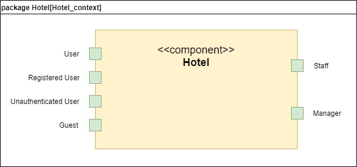
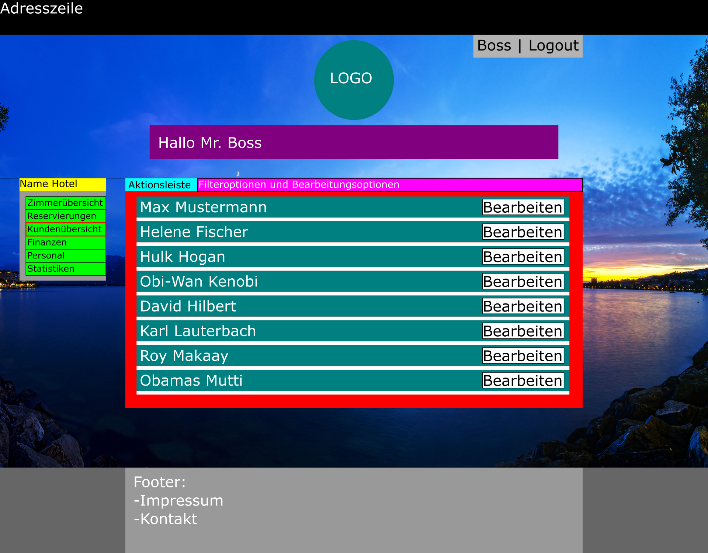
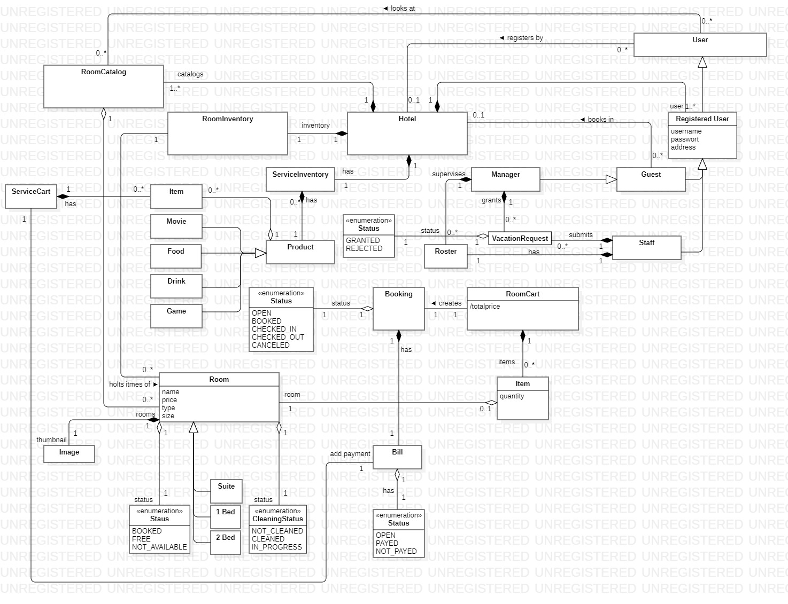

:toc:
:toclevels: 3
:toc-title:
:toc-placement!:
:sectanchors:
:numbered:

= Pflichtenheft
:project_name: HotelManagementSystem
== __{project_name}__

[options="header"]
[cols="1, 1, 1, 1, 4"]
|===
|Version | Status      | Bearbeitungsdatum   	| Autoren(en) 				|  Vermerk
|1.0     | In Arbeit   | 10.10.2021          	| Autor       				| Initiale Version
|1.1     | In Arbeit   | 26.10.2021          	| Eric Müller 				| Erste Ergänzungen
|1.1.1   | In Arbeit   | 27.10.2021        	| Eric Müller 				| Ergänzungen
|1.1.2   | In Arbeit   | 29.10.2021        	| Eric Müller 				| Zusammenfassung-IntGrp. vorläufig fertig
|1.2     | In Arbeit   | 31.10.2021          	| Mika Tax 				| vorläufig Anforderungen fertiggestellt (etwas Hilfe von Eric Müller)
|1.2.1   | In Arbeit   | 01.11.2021        	| Mika Tax 				| funktionale Anforderungen und nicht funktionale Anforderungen erweitert
|1.3     | In Arbeit   | 02.11.2021          	| Eric Müller 				| Use Case Beschreibung Version 1
|1.3.1   | In Arbeit   | 02.11.2021        	| Eric Müller 				| Use Case Beschreibung Fertig
|1.4     | In Arbeit   | 02.11.2021          	| Mika Tax 				| Ergänzungen zu funktionalen Anforderungen und nicht funktionalen Anforderungen
|1.4.1   | In Arbeit   | 02.11.2021        	| Mika Tax 				| Kann-Kriterien ergänzt
|1.5     | In Arbeit   | 02.11.2021          	| Eric Müller 				| Systemgrenze und Top-Level-Architektur Diagramme
|1.6     | In Arbeit   | 02.11.2021          	| Mika Tax, Eric Müller 		| Inhaltsverzeichnis
|1.7     | In Arbeit   | 02.11.2021          	| Mika Tax, Eric Müller, Ralf Bachmann 	| GUI Entwürfe einfügen
|1.8	 | In Arbeit   |04.11.2021	    	| Ralf Bachmann				| Akzeptanztestfälle eingefügt
|===

== Inhaltsverzeichnis

toc::[]

== Zusammenfassung

Dieses Dokument dient als Pflichtenheft für das Projekt {project_name}. Im Folgenden soll ein Überblick darüber geschaffen werden welche Anforderungen an die Software gestellt und welche Ziele erreicht werden sollen. Dementsprechend ist das Pflichtenheft also auch die Grundlage für die gesamte Zusammenarbeit zwischen Auftraggeber und dem Entwicklerteam. Des weiteren wird dargelegt wie und was die zu erstellende Software leisten muss und kann.

== Aufgabenstellung und Zielsetzung

Für ein Hotel, welches demnächst fertig gestellt wird, ist eine Software zu entwickeln, die das
Personal bei der täglichen Arbeit unterstützt. Im Vordergrund steht dabei die
Zimmerverwaltung und -reservierung. Darüber hinaus sind andere Aufgabenbereiche
abzudecken.

Das Hotel verfügt über zahlreiche Einzel- und Doppelzimmer. Diese unterscheiden sich
hinsichtlich ihrer Größe, Ausstattung und nicht zuletzt im Preis. Des weiteren bietet das Haus
seinen Gästen verschiedene Suiten mit unterschiedlicher Anzahl an Zimmern. Ebenso wie bei
den Einzel- und Doppelzimmern gibt es auch hier Suiten mit unterschiedlicher Größe und
Ausstattung. Es sei noch anzumerken, dass sich sowohl der Preis als auch die Ausstattung
der Zimmer und Suiten jederzeit ändern kann. Das Programm sollte so flexibel sein, dass es
möglichst einfach an die neuen Gegebenheiten angepasst werden kann.

Die Zimmer-Reservierung erfolgt wahlweise telefonisch oder über das Internet. Dabei ist der
prinzipielle Ablauf der Bestellung in beiden Fällen gleich. Nachdem der Gast seine Wünsche
(Anzahl Zimmer, Anzahl Betten, Ausstattung, Zeitraum, etc.) geäußert hat, soll das Programm
alle freien und den genannten Kriterien entsprechenden Zimmer auflisten. Für den Fall, dass
die gewünschte Kombination in dem angegeben Zeitraum nicht verfügbar ist, soll das System
mögliche Alternativen vorschlagen. Pro Bestellung können auch mehrere Zimmer/Suiten
reserviert werden.

Der Preis pro Übernachtung hängt zum einen von der Größe und Ausstattung der Zimmer und
zum anderen von der gewünschten Verpflegung (Frühstück, Halb- oder Vollpension) ab.
Zusätzlich wird je nach Saison ein Aufschlag berechnet.

Reservierungen können jederzeit storniert werden, jedoch wird hierfür eine Gebühr berechnet.
Hierzu müssen bereits während des Bestellvorgangs einige Daten der Gäste, wie z.B. Name
und Kreditkarten-Daten, gespeichert werden. Die Belegung bzw. Reservierung der einzelnen
Zimmer soll zu jedem Zeitpunkt abrufbar sein.

Bei der Anreise der Gäste werden ihre persönlichen Daten vervollständigt. Gäste, die nicht
anreisen, wird der volle Betrag in Rechnung gestellt. Bei Abreise erhält jeder Gast eine
detaillierte Rechnung über Kosten der Übernachtung, Verpflegung, und Zimmerservice.

Die belegten Zimmer werden täglich gereinigt. Dafür sind die Reinigungskräfte verantwortlich, die jeden Tag aufs Neue den
entsprechenden Zimmern zugeteilt werden müssen. Diese Aufgabe ist nicht immer trivial, da
die Reinigung je nach Größe der Zimmer unterschiedlich viel Zeit beansprucht. Hinzu kommt,
dass am Tag der Abreise eine Endreinigung der Zimmer notwendig ist, wofür noch mal
zusätzlich Zeit eingeplant werden muss.

Alle Zimmer verfügen über ein Terminal, über welches sich per Zimmerservice neben einer
Auswahl an Speisen und Getränken, auch Videospiele, Filme und anderes auf das Zimmer
bestellen lassen. Die Benutzung ist nur mit Hilfe des elektronischen Zimmerschlüssels
möglich, über den bei Abreise auch die Abrechnung erfolgt.

Abschließend seien noch einige Verwaltungsaufgaben erwähnt, bei welchen die Software den
Hotel-Manager nach Möglichkeiten unterstützen soll. So soll zum Beispiel jeden Tag eine
Auflistung der Einnahmen und Ausgaben des vorherigen Tages (Tagesabschluss) abrufbar
sein. Darüber hinaus soll auch eine Bilanz über einen längeren Zeitraum möglich sein. Des
weiteren benötigt der Manager auch verschiedene statistische Auswertungen, wie z.B. die
durchschnittliche Auslastung der Zimmer.

Das Personal soll außerdem die Möglichkeit haben über das System Urlaubsanträge zu
stellen, welche wiederum vom Hotel-Manager bearbeitet werden können.
Die Software soll erweiterbar und dynamisch sein um die Mitarbeiter bestmöglich zu
unterstützen. 

Zusammengefasst sollen also Gäste(_Guest_) die Möglichkeit haben Zimmer(_Room_) zu buchen(_Booking_) und stornieren (_Cancel_). Sobald ein Gast eine Reservierung abschließt, werden Persönliche Daten gespeichert (Name, Anschrift, E-Mail, Telefonnummer, Kreditkarteninformationen). Es soll auch für Gäste Möglich sein sich zu registrieren (Name, Mail, Passwort). Aber auch als nicht angemeldeter User soll man die Möglichkeit haben die noch freien Zimmer zu sehen.

Für das Personal(_Staff_) soll ein Dienstplan(_Roster_) erstellt werden und die Möglichkeit gegeben Urlaubstage einzureichen(_VacationRequest_).

Das Management(_Manager_) soll ebenso die Möglichkeiten haben Zimmer für Gäste zu buchen. Des Weiteren soll es möglich sein Statistiken (Vortags Einnahmen und Ausgaben) und Bilanzen (längerer Zeitraum) einzusehen und die Urlaubsanträge des Personals einzusehen bzw. zu bearbeiten. Außerdem muss es möglich sein neues Personal und Zimmer einzutragen bzw. auch wieder zu entfernen.

== Produktnutzung

Die Software soll bei dem Verwalten eines Hotels assistieren und so Gästen wie Personal die Möglichkeit geben Reservierungen, nach gegebenen Kriterien, vorzunehmen. Des Weiteren soll es die laufenden Kosten der Gäste und deren Kundendaten speichern sowie angestellten die Möglichkeit geben Urlaub einzureichen. Für den Manager sollen besondere Funktionen zur Verfügung stehen wie Bilanzen/Statistiken und Mitarbeiterverwaltung.

Die Software soll über diverse Browser erreichbar und dementsprechend angepasst sein.
Beispielsweise:
-	Mozilla Firefox
-	Google Chrome

Da ein Hotel grundsätzlich für jede Altersgruppe (18+) buchbar sein sollte, um möglichst viele Besucher anzuziehen ist es notwendig die Navigation und Buchung für Gäste so einfach wie möglich zu halten aber auch die Bedienung für das Personal sollte aus Zeitgründen möglichst schnell und einfach sein.

Um die Abläufe im Hotel so einfach und effizient wie möglich zu halten wäre es am besten wenn die Software wenig bis gar keinen Wartungsaufwand erzeugen würde damit sie den Nutzern konstant zur Verfügung steht.

== Interessensgruppen (Stakeholders)

Im Folgenden wird jede Personengruppe festgehalten, die mit der fertigen Software interagiert und deren Interessen somit berücksichtigt werden sollten. Jede Interessengruppe hat eine ihr zugewiesene Priorität und Ziele welche bei Interessenkonflikten so einfacher gegeneinander abgewogen werden können.

Die Priorität reicht von 1(niedrig) bis 5(hoch).
[options="header", cols="2, ^1, 4, 4"]
|===
|Name
|Priorität
|Beschreibung
|Ziele

|Nelli Rahn
|5
|Auftraggeber und Kunde
a|
- Vereinfachen der Abläufe im Hotel
- Mehr Kunden anziehen durch einfache Reservierung
- Vereinfachung der Verwaltung von Angestellten und Zimmern
- Einsicht in Bilanzen etc. für einfacheren Überblick über die Rentabilität des Hotels 

|Hotelkunden
|4
|Eine der Hauptnutzergruppen
a|
- Möglichste einfache Bedienung
- einfacher Überblick über noch freie Zimmer
- schnelle Buchung und Stornierung möglich

|Entwickler
|3
|Das Entwicklerteam, dass die Anwendung erstellt und ggf. später noch verwaltet.
a|
- Einfach erweiterbar und anpassbar
- Wenig Instandhaltungsaufwand

|Angestellte
|3
|Angestellte im Hotel die hauptsächlich mit der Software arbeiten
a|
- Einfache Buchung und Stornierung
- Urlaubsanträge schnell und einfach stellen
- Arbeitsalltag erleichtern

|===

== Systemgrenze und Top-Level-Architektur

=== Kontextdiagramm
Das Kontextdiagramm zeigt das geplante Software-System in seiner Umgebung. Zur Umgebung gehören alle Nutzergruppen des Systems und Nachbarsysteme. Die Grafik kann auch informell gehalten sein. Überlegen Sie sich dann geeignete Symbole. Die Grafik kann beispielsweise mit Visio erstellt werden. Wenn nötig, erläutern Sie diese Grafik.

[[systemcontext_diagram]]

=== Top-Level-Architektur
Dokumentieren Sie ihre Top-Level-Architektur mit Hilfe eines Komponentendiagramm.

[[component_diagram]]
image::./images/Top-Level-Arch (1).jpg[Component diagram, 100%, 100%, pdfwidth=100%, title= "Komponentendiagramm von {project_name}", align=center]

== Anwendungsfälle

=== Akteure

Akteure sind die Benutzer des Software-Systems oder Nachbarsysteme, welche darauf zugreifen. Dokumentieren Sie die Akteure in einer Tabelle. Diese Tabelle gibt einen Überblick über die Akteure und beschreibt sie kurz. Die Tabelle hat also mindestens zwei Spalten (Akteur Name und Kommentar).
Weitere relevante Spalten können bei Bedarf ergänzt werden.

// See http://asciidoctor.org/docs/user-manual/#tables
[options="header"]
[cols="1,4"]
|===
|Name |Beschreibung
|_User_ |Stellvertretend für jede Person, die mit dem System interagiert, egal ob authentifiziert oder nicht.
|_Registered User_ |Stellvertretend für jede Person, die ein Konto hat, authentifiziert ist und mit dem System interagiert.
|_Unauthenticated User_ |Vertreter für nicht authentifizierten Zugang (d.h. nicht authentifizierte Besucher).
|Guest |Jeder authentifizierte Benutzer, der die Rolle "GUEST" hat. Kann Zimmer buchen und den Roomservice nutzen.
|Manager |Jeder authentifizierte Benutzer, der die Rolle "MANAGER" hat. Hat die gleichen Funktion wie ein Guest zur verfügung und ist des weiteren für die Verwaltung des Systems zuständig.
|Staff |Jeder authentifizierte Benutzer, der die Rolle "STAFF" hat. Kann Urlaubsanträge stellen und Dienstplan einsehen.
|===

=== Überblick Anwendungsfalldiagramm
Anwendungsfall-Diagramm, das alle Anwendungsfälle und alle Akteure darstellt

[[use_case_diagram]]
image::./images/UseCaseDiagram.jpg[Use Case diagram, 100%, 100%, pdfwidth=100%, title= "Use Case Diagramm von {project_name}", align=center]

=== Anwendungsfallbeschreibungen
Dieser Unterabschnitt beschreibt die Anwendungsfälle. In dieser Beschreibung müssen noch nicht alle Sonderfälle und Varianten berücksichtigt werden. Schwerpunkt ist es, die wichtigsten Anwendungsfälle des Systems zu finden. Wichtig sind solche Anwendungsfälle, die für den Auftraggeber, den Nutzer den größten Nutzen bringen.
Für komplexere Anwendungsfälle ein UML-Sequenzdiagramm ergänzen.
Einfache Anwendungsfälle mit einem Absatz beschreiben.
Die typischen Anwendungsfälle (Anlegen, Ändern, Löschen) können zu einem Einzigen zusammengefasst werden.
[cols="1h, 3"]
[[UC0010]]
|===
|ID                         |**<<UC0010>>**

|Name                       |Login/Logout

|Beschreibung                |Ein Benutzer muss sich beim System anmelden (authentifizieren) können, um auf weitere Funktionen zuzugreifen. Dieser Vorgang soll durch Ausloggen rückgängig gemacht werden können.

|Akteure                     |User

|Auslöser                    |Anmelden: Der Benutzer möchte auf "versteckte" Funktionen zugreifen, indem er sich einloggt.
Abmelden: Benutzer möchte die Seite verlassen
.
|Voraussetzungen           a|
Anmelden: Benutzer ist noch nicht authentifiziert
Abmelden: Benutzer ist authentifiziert

|Wesentliche Schritte           a|
Anmelden:
Benutzer greift in der Navigationsleiste auf "Anmelden" zu
Benutzer gibt seine Zugangsdaten ein
Benutzer klickt auf die Schaltfläche "Anmelden"
Abmelden
Benutzer klickt in der Navigationsleiste auf "Abmelden"
Der Benutzer ist nicht authentifiziert und der Startbildschirm wird angezeigt

|Erweiterungen                 |-

|Funktionale Anforderungen    |<<MF0010>>
|===

[cols="1h, 3"]
[[UC0020]]
|===
|ID                         |**<<UC0020>>**

|Name                       |Register

|Beschreibung                |Ein nicht authentifizierter Benutzer muss in der Lage sein, ein Konto für sich selbst zu erstellen.

|Akteure                     |Unauthenticated User

|Auslöser                    |Nicht authentifizierter Benutzer möchte sich ein Konto erstellen, indem er auf "Registrieren" drückt.
.
|Voraussetzungen           |Akteur ist noch nicht angemeldet (authentifiziert)

|Wesentliche Schritte           a|
Nicht authentifizierter Benutzer drückt auf "Registrieren"
Er gibt seinen Vor- und Nachnamen, E-Mail Adresse, Telefonnummer, Wohnort, Kreditkartendaten und Passwort an
System prüft E-Mail Eindeutigkeit
Wenn einzigartig: Ein Konto wird mit den angegebenen Daten erstellt
Andernfalls: Es wird eine Fehlermeldung angezeigt

|Erweiterungen                 |-

|Funktionale Anforderungen    |<<MF0020>>
|===

[cols="1h, 3"]
[[UC0031]]
|===
|ID                         |**<<UC0031>>**

|Name                       |View RoomCatlog

|Beschreibung                |Ein User Muss in der Lage seine den Zimmerkatalog einsehen zu können.

|Akteure                     |User

|Auslöser                    |Auswählen der verknüpfung die zum Zimmerkatalog weiterleitet.
.
|Voraussetzungen           |

|Wesentliche Schritte           a|
Nutzer wählt das Navigationselement das zum Zimmerkatalog führt aus
Es wird der Zimmerkaalog dargestellt

|Erweiterungen                 |-

|Funktionale Anforderungen    |<<MF0111>>
|===

[[sequence_diagram_view_roomcatalog]]

[cols="1h, 3"]
[[UC0032]]
|===
|ID                         |**<<UC0032>>**

|Name                       |View RoomDetails

|Beschreibung                |Ein Nutzer Muss in der Lage sein sich details zu Zimmern anzusehen

|Akteure                     |User

|Auslöser                    |User klickt auf ein Zimmer.

|Voraussetzungen           |User sieht den Zimmerkatalog.

|Wesentliche Schritte           a|
User wählt das Navigationselement aus das zu einem einzelnen zimmer verlinkt.
User wird zu seite mit details zum Zimmer weitergeleitet.

|Erweiterungen                 |-

|Funktionale Anforderungen    |<<MF0120>>
|===

[cols="1h, 3"]
[[UC0041]]
|===
|ID                         |**<<UC0041>>**

|Name                       |Add Room to RoomCart

|Beschreibung                |Ein Gast oder Manager muss in der Lage sein Zimmer, für eine Buchung, zu einem Warenkorb hinzuzufügen.

|Akteure                     |Guest

|Auslöser                    |Ein Gast oder Manager will ein Zimmer zum Warenkorb hinzufügen.
.
|Voraussetzungen           |Akteur sieht die Detail Ansicht eines Zimmers oder den Katalog

|Wesentliche Schritte           a|
Nutzer sieht die Detail Ansicht eines Zimmers oder den Katalog
Nutzer wählt die Schaltfläche aus die das Zimmer zur späteren Buchung zum Warenkorb hinzugefügt.
Zimmer wird zum Warenkorb hinzugefügt.

|Erweiterungen                 |-

|Funktionale Anforderungen    |<<MF0201>>
|===

[[sequence_diagram_add_room_to_roomcart]]

[cols="1h, 3"]
[[UC0042]]
|===
|ID                         |**<<UC0042>>**

|Name                       |View RoomCart

|Beschreibung                |Ein Gast oder Manager muss in der Lage sein den aktuellen Zimmerwarenkorb zu sehen.

|Akteure                     |Guest

|Auslöser                    |Ein Gast oder Manager will die Zimmer im Warenkorb einsehen.

|Voraussetzungen           |

|Wesentliche Schritte           a|
Der Nutzer klickt auf das Navigationselement, welches zum Warenkorb weiterleitet.
Der Warenkorb wird angezeigt.

|Erweiterungen                 |-

|Funktionale Anforderungen    |<<MF0110>>
|===

[cols="1h, 3"]
[[UC0051]]
|===
|ID                         |**<<UC0043>>**

|Name                       |Book Rooms in RoomCart

|Beschreibung                |Ein Gast oder Manager muss in der Lage sein die Zimmer im Warenkorb zu buchen.

|Akteure                     |Guest

|Auslöser                    |Ein Gast oder Manager will Zimmer im Warenkorb buchen.
.
|Voraussetzungen           |Es befinden sich ein oder mehrere Zimmer im Warenkorb

|Wesentliche Schritte           a|
Nutzer sieht den Warenkorb.
Nutzer wählt das Bedienelement zum Abschluss der Buchung aus.

|Erweiterungen                 |-

|Funktionale Anforderungen    |<<MF0220>>
|===

[cols="1h, 3"]
[[UC0052]]
|===
|ID                         |**<<UC0052>>**

|Name                       |Cancel Booking

|Beschreibung                |Ein Gast oder Manager muss in der Lage sein eine Buchung vor Abschluss abzubrechen.

|Akteure                     |Guest

|Auslöser                    |Ein Gast oder Manager will eine Buchung vor Abschluss abbrechen.
.
|Voraussetzungen           |Der Nutzer hat eine aktuell laufende Buchung.

|Wesentliche Schritte           a|
Eine Buchung ist im Gange.
Der Nutzer klickt auf “Buchung abbrechen” .
Die Buchung wird abgebrochen und der Nutzer wird zur Startseite weitergeleitet.

|Erweiterungen                 |-

|Funktionale Anforderungen    |<<MF0243>>
|===

[cols="1h, 3"]
[[UC0053]]
|===
|ID                         |**<<UC0053>>**

|Name                       |View Booking

|Beschreibung                |Ein Gast muss in der Lage sein, seine Buchungen einzusehen.

|Akteure                     |Guest

|Auslöser                    |Ein Gast will seine Buchung einsehen.
.
|Voraussetzungen           | -

|Wesentliche Schritte           a|
Der Nutzer wählt das Navigationselement aus, dass zu den Buchungen weiter leitet.
Die Buchungen werden angezeigt.

|Erweiterungen                 |-

|Funktionale Anforderungen    |<<MF0246>>
|===

[cols="1h, 3"]
[[UC0054]]
|===
|ID                         |**<<UC0054>>**

|Name                       |View Bill

|Beschreibung                |Ein Gast oder Manager muss in der Lage sein eigene Rechnungen einzusehen.

|Akteure                     |Guest

|Auslöser                    |Ein Gast oder Manager will eigene Rechnungen einsehen.

|Voraussetzungen           |

|Wesentliche Schritte           a|
Der Nutzer wählt das Navigationselement aus das zu den Rechungen weiterleitet.
Die Rechnungen werden angezeigt.

|Erweiterungen                 |-

|Funktionale Anforderungen    |<<MF0730>>
|===

[cols="1h, 3"]
[[UC0061]]
|===
|ID                         |**<<UC0061>>**

|Name                       |View ServiceCatalog

|Beschreibung                |Ein Gast muss in der Lage sein den Roomservice Katalog einzusehen.

|Akteure                     |Guest

|Auslöser                    |Ein Gast will sich den Roomservice Katalog ansehen.
.
|Voraussetzungen           a|
Die Buchung des Gastes hat den Status “CHECKED IN”.

|Wesentliche Schritte           a|
Der Gast wählt das Navigationselement aus das den Roomservice Catalog anzeigt aus.
Er wird zum Katalog weitergeleitet.

|Erweiterungen                 |-

|Funktionale Anforderungen    |<<MF0421>>
|===

[cols="1h, 3"]
[[UC0062]]
|===
|ID                         |**<<UC0062>>**

|Name                       |Add Product to ServiceCart

|Beschreibung                |Ein Gast muss in der Lage sein Dinge aus dem Roomservice Katalog in den Warenkorb zu legen.

|Akteure                     |Guest

|Auslöser                    |Ein Gast will etwas aus dem Roomservice Katalog in den Warenkorb tun.
.
|Voraussetzungen           a|

|Wesentliche Schritte           a|
Nutzer sieht den Katalog.
Nutzer wählt die Schaltfläche aus die den Gegenstand zum Warenkorb hinzugefügt.
Gegenstand wird zum Warenkorb hinzugefügt.

|Erweiterungen                 |-

|Funktionale Anforderungen    |<<MF0411>>
|===

[cols="1h, 3"]
[[UC0063]]
|===
|ID                         |**<<UC0063>>**

|Name                       |View ServiceCart

|Beschreibung                |Ein Gast muss in der Lage sein Dinge im Warenkorb anzusehen.

|Akteure                     |Guest

|Auslöser                    |Ein Gast will etwas aus dem Roomservice Katalog in den Warenkorb tun.
.
|Voraussetzungen           a|
Der Nutzer sieht die Seite mit dem Roomservice Katalog.

|Wesentliche Schritte           a|
Nutzer sieht den Katalog.
Nutzer wählt die Schaltfläche aus die den Gegenstand zum Warenkorb hinzugefügt.
Gegenstand wird zum Warenkorb hinzugefügt.

|Erweiterungen                 |-

|Funktionale Anforderungen    |<<MF0412>>
|===

[cols="1h, 3"]
[[UC0064]]
|===
|ID                         |**<<UC0064>>**

|Name                       |Buy Products in ServiceCart

|Beschreibung                |Ein Gast muss in der Lage sein Dinge im Warenkorb zu kaufen.

|Akteure                     |Guest

|Auslöser                    |Ein Gast will die Gegenstände im Warenkorb kaufen.
.
|Voraussetzungen           a|

|Wesentliche Schritte           a|
Nutzer sieht den Warenkorb.
Nutzer wählt das Bedienelement zum Abschluss des Kaufs aus.

|Erweiterungen                 |-

|Funktionale Anforderungen    |<<MF0413>>
|===

[cols="1h, 3"]
[[UC0071]]
|===
|ID                         |**<<UC0071>>**

|Name                       |Create Vacation Request

|Beschreibung                |Ein Mitarbeiter muss die möglichkeit haben Urlaubsanträge einzureichen.

|Akteure                     |Staff

|Auslöser                    |Ein Mitarbeiter will einen Urlaubsantrag einreichen.
.
|Voraussetzungen           a|

|Wesentliche Schritte           a|
Der Mitarbeiter wählt das Navigationselement, dass zu der Seite zum Einreichen von Urlaubsanträgen weitergeleitet.
Der Mitarbeiter wählt einen gewünschten Zeitraum.
Der Mitarbeiter schickt den Antrag durch klicken auf den dementsprechenden Button ab.

|Erweiterungen                 |-

|Funktionale Anforderungen    |<<MF0600>>
|===

[cols="1h, 3"]
[[UC0072]]
|===
|ID                         |**<<UC0072>>**

|Name                       |View Roster

|Beschreibung                |Ein Mitarbeiter muss die Möglichkeit haben seinen Dienstplan einzusehen. Der Manager muss die Möglichkeit haben den gesamten Dientsplan einzusehen.

|Akteure                     |Staff/Manager

|Auslöser                    |Ein Mitarbeiter will seinen Dienstplan sehen. Der Manager will den gesamten Dienstplan einsehen.
.
|Voraussetzungen           a|

|Wesentliche Schritte           a|
Der Mitarbeiter/Manager wählt das Navigationselement das zu der Seite mit den Dienstplänen führt. 
Dem Mitarbeiter/Manager wird der Dienstplan angezeigt.

|Erweiterungen                 |-

|Funktionale Anforderungen    |<<MF0520>>
|===

[cols="1h, 3"]
[[UC0081]]
|===
|ID                         |**<<UC0081>>**

|Name                       |View Staff List

|Beschreibung                |Ein Manager muss die Möglichkeit haben die Mitarbeiter Liste einzusehen und zu bearbeiten.

|Akteure                     |Manager

|Auslöser                    |Der Manager will die Mitarbeiter Liste einsehen oder bearbeiten.
.
|Voraussetzungen           a|

|Wesentliche Schritte           a|
Der Manager wählt das Navigationselement das zu der Seite mit der Mitarbeiterliste führt. 
Dem Manager wird der Mitarbeiterliste angezeigt.
Mitarbeiter lassen sich über Schaltflächen bearbeiten, löschen und hinzufügen.

|Erweiterungen                 |-

|Funktionale Anforderungen    |<<MF0310>>
|===

[cols="1h, 3"]
[[UC0082]]
|===
|ID                         |**<<UC0082>>**

|Name                       |View GuestList

|Beschreibung                |Ein Manager muss die Möglichkeit haben die Gästeliste einzusehen.

|Akteure                     |Manager

|Auslöser                    |Der Manager will die Gästeliste einsehen.
.
|Voraussetzungen           a|

|Wesentliche Schritte           a|
Der Manager wählt das Navigationselement, dass zu der Seite mit der Gästeliste führt. 
Dem Manager wird die Gästeliste angezeigt.

|Erweiterungen                 |-

|Funktionale Anforderungen    |<<MF0300>>
|===

[cols="1h, 3"]
[[UC0083]]
|===
|ID                         |**<<UC0083>>**

|Name                       |View Booking List

|Beschreibung                |Ein Manager muss die Möglichkeit haben die Liste mit allen Buchungen einzusehen.

|Akteure                     |Manager

|Auslöser                    |Der Manager will die Buchungsliste einsehen.
.
|Voraussetzungen           a|

|Wesentliche Schritte           a|
Der Manager wählt das Navigationselement, dass zu der Seite mit der Buchungsliste führt. 
Dem Manager wird die Buchungsliste angezeigt.

|Erweiterungen                 |-

|Funktionale Anforderungen    |<<MF0320>>
|===

[cols="1h, 3"]
[[UC0084]]
|===
|ID                         |**<<UC0084>>**

|Name                       |View Inventory

|Beschreibung                |Ein Manager muss die Möglichkeit haben die Inventories einzusehen und zu bearbeiten.

|Akteure                     |Manager

|Auslöser                    |Der Manager will die Inventories einsehen oder bearbeiten.
.
|Voraussetzungen           a|

|Wesentliche Schritte           a|
Der Manager wählt das Navigationselement das zu der Seite mit den Inventories führt. 
Dem Manager werden die Inventories angezeigt.
Die Inventories können über Schaltflächen editiert werden

|Erweiterungen                 |-

|Funktionale Anforderungen    |<<MF0330>> / <<MF0340>>  /  <<MF0350>> / <<MF0360>>
|===

[cols="1h, 3"]
[[UC0085]]
|===
|ID                         |**<<UC0085>>**

|Name                       |View Vacation Requests

|Beschreibung                |Ein Manager muss die Möglichkeit haben die Urlaubsanträge einzusehen, anzunehmen oder abzulehnen.

|Akteure                     |Manager

|Auslöser                    |Der Manager will die Urlaubsanträge einsehen oder bearbeiten.
.
|Voraussetzungen           a|

|Wesentliche Schritte           a|
Der Manager wählt das Navigationselement das zu der Seite mit den Urlaubsanträgen führt. 
Dem Manager werden die Urlaubsanträge angezeigt.

|Erweiterungen                 |-

|Funktionale Anforderungen    |<<MF0390>>
|===

[cols="1h, 3"]
[[UC0086]]
|===
|ID                         |**<<UC0086>>**

|Name                       |View Statistics

|Beschreibung                |Ein Manager muss die Möglichkeit haben die Statistiken des Vortages einzusehen.

|Akteure                     |Manager

|Auslöser                    |Der Manager will die Statistiken einsehen.

|Voraussetzungen           a|

|Wesentliche Schritte           a|
Der Manager wählt das Navigationselement, dass zu der Seite mit den Statistiken führt. 
Dem Manager werden die Statistiken angezeigt.

|Erweiterungen                 |-

|Funktionale Anforderungen    |<<MF0370>>
|===

[cols="1h, 3"]
[[UC0087]]
|===
|ID                         |**<<UC0087>>**

|Name                       |View Balance

|Beschreibung                |Ein Manager muss die Möglichkeit haben die Bilanzen einzusehen.

|Akteure                     |Manager

|Auslöser                    |Der Manager will die Bilanzen einsehen.

|Voraussetzungen           a|

|Wesentliche Schritte           a|
Der Manager wählt das Navigationselement, dass zu der Seite mit den Bilanzen führt. 
Dem Manager werden die Bilanzen angezeigt.

|Erweiterungen                 |-

|Funktionale Anforderungen    |<<MF0380>>
|===

== Funktionale Anforderungen

Die Tabellen enthalten:

  - Eine ID zum Verweisen auf die Kriterien im Pflichtenheft
  - Aktuelle Version der Anforderung
  - Name
  - Beschreibung

=== Muss-Kriterien
Was das zu erstellende Programm auf alle Fälle leisten muss.

[options="header", cols="2h, 1, 3, 12"]
|===
|ID
|Version
|Name
|Beschreibung

|[[MF0010]]<<MF0010>>
|v0.1
|Authentifizierung
a|
Das System muss in öffentlich zugängliche Teile und in Teile, die eine Authentifizierung fordern, unterteilt werden. Ein im System vorhandener Benutzer kann sich durch die Angabe folgender Informationen authentifizieren (registrierter Nutzer):

* E-Mail
* Passwort

|[[MF0020]]<<MF0020>>
|v0.1
|Registrierung
a|
Das System muss einem unauthentifizerten Benutzer (<<MF0010>>) die Möglichkeit bieten, sich über den Zugriff auf das Navigationselement "Registrieren" zu registrieren.

Benötigte Informationen:

* E-Mail
* Nachname
* Vorname
* Passwort

Das System muss die eingegebenen Daten validieren (<<MF0021>>).
Der Nutzer wird als Gast oder Mitarbeiter registriert und kann sich nach erfolgreicher Validierung Authentifizieren (<<MF0010>>).

|[[MF0021]]<<MF0021>>
|v0.1
|Valideren der Registrierung
a|
Das System muss die Registrierungsdaten des unregistrierten Nutzers validieren können.

Die Einzigartigkeit der E-Mail muss gegeben sein.
Der Nutzer wird bei Eingabeverstößen infomiert.

|[[MF0100]]<<MF0100>>
|v0.1
|Inventar
a|
Das System muss die Daten der Zimmer permament speichern können.

|[[MF0101]]<<MF0101>>
|v0.1
|Zimmer buchen
a|
Das System muss gebuchte Zimmer sperren können.

|[[MF0110]]<<MF0110>>
|v0.1
|Zimmerkatalog
a|
Das System muss Lesezugriff auf die vorhandenen Zimmer im Zimmerkatalog gewähren.

|[[MF0111]]<<MF0111>>
|v0.1
|Zimmerkatalog anzeigen
a|
Das System muss dem Gast den Inhalt des Katalogs anzeigen können.

|[[MF0112]]<<MF0112>>
|v0.1
|Zimmerkatalog Filtern
a|
Das System sollte dem Gast die Möglichkeit, den Katalog zu filtern, bereitstellen (z.B. Einzelzimmer, Doppelzimmer oder Suite).

|[[MF0120]]<<MF0120>>
|v0.1
|Zimmerdetails anzeigen
a|
Das System muss dem Gast Details zum ausgewählten Zimmer anzeigen können.
Folgende Details sollten sichtbar sein:

- Zimmername/-nummer
- Preis
- Bettenanzahl
- Raumanzahl
- Ausstattung
- Verfügbarkeit
- ggf. Bild des Zimmers

|[[MF0200]]<<MF0200>>
|v0.1
|Warenkorb
a|
Das System muss einen Warenkorb für den Gast bereitstellen können.

|[[MF0201]]<<MF0201>>
|v0.1
|Zimmer zum Warenkorb hinzufügen
a|
Das System muss dem Gast die Möglichkeit bieten ein Zimmer zu buchen und somit in den Warenkorb hinzuzufügen.

Beim Hinzufügen eines Zimmers sollte ein Eintrag im Warenkorb erstellt werden.

Nicht authentifizerte Nutzer werden aufgefordert sich zum Buchen eines Zimmers zu registrieren.

|[[MF0210]]<<MF0210>>
|v0.1
|Warenkorb anzeigen
a|
Das System muss einem Gast die Möglichkeit bieten den Warenkorb anzuzeigen.
Der Warenkorb sollte folgendes auflisten:

- Zimmername/-nummer
- Zeitraum der Buchung
- Einzelpreis der Zimmer
- Gesamtpreis des Warenkorbs

|[[MF0220]]<<MF0220>>
|v0.1
|Zimmer im Warenkorb buchen
a|
Das System muss dem Gast die Möglichkeit bieten den Inhalt des Warenkorbs zu buchen.

Beim Versuch den Inhalt zu buchen, muss die mögliche Buchung validiert werden (<<MF0230>>).

Eine Buchung wird erstellt, wenn das/die Zimmer verfügbar sind (<<MF0241>>).

|[[MF0230]]<<MF0230>>
|v0.1
|Validierung verfügbarer Zimmer
a|
Das System muss überprüfen können ob die gewählten Zimmer verfügbar sind.

|[[MF0240]]<<MF0240>>
|v0.1
|Buchungen speichern
a|
Das System muss in der Lage sein, Buchungen dauerhaft zu speichern.

|[[MF0241]]<<MF0241>>
|v0.1
|Buchung erstellen
a|
Das System muss eine Buchung aus dem Inhalt des Warenkorbs erstellen können.

Eine Buchung wird mit dem Status "OPEN" initialisiert.

|[[MF0242]]<<MF0242>>
|v0.1
|Buchung abschließen
a|
Das System muss die Funktionalität bereitstellen eine existierende "OPEN" Buchung abzuschließen.

Nach abschließen der Buchung wird dessen Status auf "BOOKED" gesetzt.

|[[MF0243]]<<MF0243>>
|v0.1
|Buchung stornieren
a|
Das System muss dem Gast die Funktionalität bereitstellen eine existierende Buchung zu stornierenn.

Nach stornieren der Buchung wird dessen Status auf "CANCELED" gesetzt.

|[[MF0244]]<<MF0244>>
|v0.1
|Buchung zur Rechnung hinzufügen
a|
Das System muss die Möglichkeit bieten den Gesamtpreis der Buchung zur Rechnung hinzuzufügen (<<MF0720>>), wenn die Buchung den Status "CHECKED OUT" oder "CANCELED" erreicht.

|[[MF0245]]<<MF0245>>
|v0.1
|Buchung archivieren
a|
Das System muss eine Buchung archivieren können.

Eine Buchung wird archiviert, indem der Status auf "CHECKED OUT" oder "CANCELED" gesetzt wird.

|[[MF0246]]<<MF0246>>
|v0.1
|Buchung anzeigen
a|
Das System muss dem Gast die Funktionalität bereitstellen, alle seine Buchungen einzusehen.

|[[MF0300]]<<MF0300>>
|v0.1
|Gastliste anzeigen
a|
Das System muss für den Manager die Funktionalität bereitstellen alle Gäste anzuzeigen.

|[[MF0310]]<<MF0310>>
|v0.1
|Personalliste anzeigen
a|
Das System muss für den Manager die Funktionalität bereitstellen alle Arbeitnehmer anzuzeigen.

|[[MF0311]]<<MF0311>>
|v0.1
|Personaliste bearbeiten
a|
Das System muss für den Manager die Funktionalität bereitstellen Personal zu registrieren (<<MF0020>>), zu bearbeiten und zu löschen.

|[[MF0320]]<<MF0320>>
|v0.1
|Buchungen anzeigen
a|
Das System muss dem Manager die Funktionalität bereitstellen alle Buchungen mit dem Status "BOOKED", "CHECKED IN", "CHECKED OUT" und "CANCELED" anzuzeigen.

Folgende Informationen sollten für jede Buchung angezeigt werden:

- Zeitstempel der Erstellung
- Status
- Zimmernamen
- Zeitraum der Buchung
- Buchender Nutzer
- Persönliche Daten des Kunden
- Gesamtpreis der Buchung

|[[MF0330]]<<MF0330>>
|v0.1
|Inventar anzeigen
a|
Das System muss dem Manager die Funktionalität bereitstellen das Zimmerinventar des Hotels anzusehen.

Folgende Informationen der Zimmer sollten angezeigt werden:

- Zimmername/-nummer
- Preis
- Bettenanzahl
- Raumanzahl
- Ausstattung
- Verfügbarkeit
- ggf. Bild des Zimmers

|[[MF0340]]<<MF0340>>
|v0.1
|Inventar bearbeiten
a|
Das System muss dem Manager die Funktionalität bereitstellen das Zimmerinventar des Hotels zu bearbeiten, also Zimmer hinzuzufügen, zu bearbeiten und zu löschen.

Folgende Informationen der Zimmer werden benötigt:

- Zimmername/-nummer
- Preis
- Bettenanzahl
- Raumanzahl
- Ausstattung
- Verfügbarkeit
- ggf. Bild des Zimmers

|[[MF0350]]<<MF0350>>
|v0.1
|Roomservice Inventar anzeigen
a|
Das System muss dem Manager die Funktionalität bereitstellen das Roomservice-Inventar des Hotels anzusehen.

Folgende Informationen der Waren sollten angezeigt werden:

- Warenbezeichnung
- Preis

|[[MF0360]]<<MF0360>>
|v0.1
|Roomservice Inventar bearbeiten
a|
Das System muss dem Manager die Funktionalität bereitstellen das Roomservice-Inventar des Hotels zu bearbeiten, also Waren hinzuzufügen, zu bearbeiten und zu löschen.

Folgende Informationen der Waren werden benötigt:

- Warenbezeichnung
- Preis

|[[MF0370]]<<MF0370>>
|v0.1
|Statistiken anzeigen
a|
Das System muss dem Manager die Funktionalität bereitstellen die Statistiken des Hotels anzuzeigen.

|[[MF0380]]<<MF0380>>
|v0.1
|Bilanzen anzeigen
a|
Das System muss dem Manager die Funktionalität bereitstellen die Bilanzen des Hotels anzuzeigen.

|[[MF0390]]<<MF0390>>
|v0.1
|Urlaubstage bearbeiten
a|
Das System muss dem Manager die Funktionalität gewünschte Urlaubstage zu akzeptieren oder abzulehnen.

|[[MF0400]]<<MF0400>>
|v0.1
|Roomservice Inventar
a|
Das System muss die zu bestellendaren Waren permament speichern können.

|[[MF0410]]<<MF0410>>
|v0.1
|Roomservice Warenkorb
a|
Das System muss einen Warenkorb für den Roomservice des Gastes bereitstellen.

|[[MF0411]]<<MF0411>>
|v0.1
|Roomservice Waren zum Warenkorb hinzufügen
a|
Das System muss dem Gast die Möglichkeit bieten Waren zu bestellen und somit in den Warenkorb hinzuzufügen.

Beim Hinzufügen einer Ware sollte ein Eintrag im Warenkorb erstellt werden.

|[[MF0412]]<<MF0412>>
|v0.1
|Roomservice Warenkorb anzeigen
a|
Das System muss einem Gast die Möglichkeit bieten den Warenkorb anzuzeigen.
Der Warenkorb sollte folgendes auflisten:

- Zimmername/-nummer
- Gast
- Warenname
- Warenpreis einzeln
- Gesamtpreis

|[[MF0413]]<<MF0413>>
|v0.1
|Roomservice Warenkorb zur Rechnung hinzufügen
a|
Das System muss die Möglichkeit bieten den Roomservice Warenkorb zur Rechnung hinzuzufügen (<<MF0720>>).

|[[MF0420]]<<MF0420>>
|v0.1
|Roomservice Katalog
a|
Das System muss Lesezugriff auf die vorhandenen Waren im Roomservice Katalog gewähren.

|[[MF0421]]<<MF0421>>
|v0.1
|Roomservice Katalog anzeigen
a|
Das System muss dem Gast die Funktionalität bieten den Roomservice-Katalog anzusehen.

|[[MF0500]]<<MF0500>>
|v0.1
|Dienstplan speichern
a|
Das System muss einen Dienstplan permanent speichern können.

|[[MF0510]]<<MF0510>>
|v0.1
|Dienstplan erstellen
a|
Das System muss die Möglichkeit bieten einen Dienstplan zu erstellen.

|[[MF0520]]<<MF0520>>
|v0.1
|Dienstplan anzeigen
a|
Das System muss dem Manager und dem Personal die Funktionalität bieten den Dienstplan einzusehen.

|[[MF0600]]<<MF0600>>
|v0.1
|Urlaubstage einreichen
a|
Das System muss dem Personal die Funktionalität gewünschte Urlaubstage einzureichen.

|[[MF0700]]<<MF0700>>
|v0.1
|Rechnung speichern
a|
Das System muss Rechnungen permament speichern können.

|[[MF0710]]<<MF0710>>
|v0.1
|Rechnung initialisieren
a|
Das System muss eine Rechnung zu einer Buchung initialiieren, die den Status "CHECKED OUT" oder "CANCELED" erreicht.

|[[MF0720]]<<MF0720>>
|v0.1
|Rechnungsposition hinzufügen
a|
Das System muss die Funktionalität bieten Rechnungspositionen zur Rechnung hinzuzufügen.

|[[MF0730]]<<MF0730>>
|v0.1
|Rechnung anzeigen
a|
Das System muss dem Gast die Funktionalität die Rechnung anzusehen.

|===

=== Kann-Kriterien
Anforderungen die das Programm leisten können soll, aber für den korrekten Betrieb entbehrlich sind.
[options="header", cols="2h, 1, 3, 12"]
|===
|ID
|Version
|Name
|Beschreibung

|[[KF0000]]<<KF0000>>
|v0.1
|Bewertung speichern
a|
Das System muss in der Lage sein eine Bewertung aus einem Rating und eventuell einem Kommentar zu speichern.

|[[KF0010]]<<KF0010>>
|v0.1
|Bewertungen ansehen
a|
Das System muss in der Lage sein die Bewertungen anzuzeigen.

|[[KF0020]]<<KF0020>>
|v0.1
|Bewertung erstellen
a|
Das System muss dem Gast die Funktionalität bereitstellen eine Bewertung zu erstellen.

|[[KF0021]]<<KF0021>>
|v0.1
|Bewertung bearbeiten
a|
Das System muss dem Gast die Funktionalität bereitstellen die eigene Bewertung zu bearbeiten.

|[[KF0022]]<<KF0022>>
|v0.1
|Bewertung löschen
a|
Das System muss dem Gast die Funktionalität bereitstellen seine eigene Bewertung zu löschen.

|[[KF0030]]<<KF0030>>
|v0.1
|Bewertungen löschen
a|
Das System muss dem Manager die Funktionalität bereitstellen die Bewertungen zu löschen.

|===

== Nicht-Funktionale Anforderungen

=== Qualitätsziele

Dokumentieren Sie in einer Tabelle die Qualitätsziele, welche das System erreichen soll, sowie deren Priorität.

1 = Unwichtig ..
5 = Sehr wichtig
[options="header", cols="3h, ^1, ^1, ^1, ^1, ^1"]
|===
|Qualitätsanforderungen       | 1 | 2 | 3 | 4 | 5
|Sicherheit                   |   |   |   |   | x
|Benutzbarkeit                |   |   |   | x |
|Verlässlichkeit              |   |   |   | x |
|Funktionale Eignung          |   |   |   |   | x
|Effiziente Performance       |   |   | x |   |
|===

=== Konkrete Nicht-Funktionale Anforderungen

Beschreiben Sie Nicht-Funktionale Anforderungen, welche dazu dienen, die zuvor definierten Qualitätsziele zu erreichen.
Achten Sie darauf, dass deren Erfüllung (mindestens theoretisch) messbar sein muss.

[options="header", cols="2h, 1, 3, 12"]
|===
|ID
|Version
|Name
|Description

|[[NF0010]]<<NF0010>>
|v0.1
|Sicherheit - Userdaten
a|
Passwörter und persönliche Daten werden verschlüsselt abgespeichert abgespeichert um Diebstahl zu verhindern.

|[[NF0020]]<<NF0020>>
|v0.1
|Verlässlichkeit
a|
Das System sollte möglichst permanent erreichbar sein (99% Online-Zeit).

|[[NF0030]]<<NF0030>>
|v0.1
|Barrierefreiheit
a|
Das System muss auf der Webseite große und eindeutige Schaltflächen, sowie einen starken Kontrast und ein für Sehschwächen angepasstes Farbschema aufweisen.

|===

== GUI Prototyp

In diesem Kapitel soll ein Entwurf der Navigationsmöglichkeiten und Dialoge des Systems erstellt werden.
Idealerweise entsteht auch ein grafischer Prototyp, welcher dem Kunden zeigt, wie sein System visuell umgesetzt werden soll.
Konkrete Absprachen - beispielsweise ob der grafische Prototyp oder die Dialoglandkarte höhere Priorität hat - sind mit dem Kunden zu treffen.

=== Startseiten
{empty} +

[[homepage]]

{empty} +
{empty} +

[[registration]]

{empty} +
{empty} +

[[booking_page]]

{empty} +

=== Managementseiten
{empty} +

[[konto_boss]]

{empty} +
{empty} +

[[konto_boss_zimmeruebersicht]]

{empty} +
{empty} +

[[konto_boss_reservierungen]]

{empty} +
{empty} +

[[konto_boss_kundenuebersicht]]

{empty} +
{empty} +

[[konto_boss_finanzen]]

{empty} +
{empty} +

[[konto_boss_dienstplan]]

{empty} +
{empty} +

[[konto_boss_urlaubsplan]]

{empty} +

=== Personalseiten
{empty} +

[[konto_staff]]

{empty} +
{empty} +

[[konto_staff_dienstplan]]

{empty} +
{empty} +

[[konto_staff_urlaubseinreichung]]

{empty} +

=== Gastseiten
{empty} +

[[konto_guest]]

{empty} +
{empty} +

[[konto_guest_buchungen]]

{empty} +
{empty} +

[[konto_guest_pDaten]]

{empty} +
{empty} +

[[konto_guest_zimmerservice]]

== Datenmodell

=== Klassendiagramm
Das (Analyse-)Klassendiagramm soll einen Überblick über die Domäne im Kontext des Systems geben, dass im Rahmen dieses Projektes entwickelt werden soll.

[[AKD]]

=== Klassen und Enumerationen
Die folgende Tabelle gibt einen Überblick über die im Domänenmodell verwendeten Klassen/ Enumerationen.
Daher ist dieser Abschnitt eine Teilmenge des <<Glossar, Glossar>> und soll verwendet werden, um allen Beteiligten ein gemeinsames Verständnis zentraler Begriffe und Konzepte der Domäne des Systems zu vermitteln.

:Hotel_Beschreibung: Zentrale Klasse des Systems, welche das Hotel selbst repräsentiert.

[options="header", cols="1h, 4"]
[[Klassen_Enummerationen]]
|===
|Klasse/ Enummerationen     		|Beschreibung
|Hotel					| Abstraktion des Onlineshops des Hotels
|ServiceCart                   		| Ein Service Warenkorb ist ein temporärer Speicher für Dienstleistungen, die ein Gast buchen möchte. Entscheidet sich ein Kunde, seine ausgewählten Zimmer zu buchen, wird eine Buchung erstellt.
|Image                			| Ein Bild ist eine digitale Ansicht, die einen Raum visuell abbildet.
|RoomCatalog                 		| Ein Raumkatalog ist eine Sammlung von Räumen.
|RoomInventory              		| Ein Raumkatalog ist ein Zwischenspeicher für selektierte Räumen.
|Item              			| Stellt ein Zimmer im Warenkorb dar.
|Movie              			| Ein Produkttyp, der aus dem Serviceinventar bezogen werden kann.
|Food              			| Ein Produkttyp, der aus dem Serviceinventar bezogen werden kann.
|Drink              			| Ein Produkttyp, der aus dem Serviceinventar bezogen werden kann.	
|Game              			| Ein Produkttyp, der aus dem Serviceinventar bezogen werden kann.	
|Room                 			| Überbegriff der Zimmertypen des Hotels
|Suite                 			| Eine Suite ist ein möglicher Zimmertyp, mit dem Räume im Katalog differenziert werden.
|1 Bed                    		| Ein 1-Bett-Zimmer ist ein möglicher Zimmertyp,  mit dem Räume im Katalog differenziert werden.
|2 Bed                    		| Ein 2-Bett-Zimmer ist ein möglicher Zimmertyp,  mit dem Räume im Katalog differenziert werden.
|ServiceInventory              		| Ein Inventar stellt einen virtuellen Speicher für das Hotel dar. Kann in diesem Projekt als Lager angesehen werden.
|Product              			| Teil des Serviceinventars.
|Booking                 		|Eine Buchung wird verwendet, um darzustellen, was ein Gast des Hotels beim Hotel buchen möchte. Ein Auftrag kann einen Status haben, um den aktuellen Schritt zu symbolisieren, in dem der Auftrag bearbeitet wird.
|Bill            			| Eine Rechnung wird verwendet, um darzustellen, was ein Gast des Hotels zu zahlen hat. Eine Rechnung kann einen Status haben, um den aktuellen Schritt zu symbolisieren, in dem die Rechnung verarbeitet wird.
|Roster            			| Ein Arbeitsplan, an den sich die Mitarbeiter halten müssen.
|Manager               			| Ein Benutzer, der als Administrator/ Chef des Hotels registriert ist.
|VacationRequest               		| Eine vom Personal gestellte und vom Manager regulierte Urlaubsanfrage.
|RoomCart                   		|Ein Warenkorb ist ein temporärer Speicher für Zimmer, die ein Gast buchen möchte. Entscheidet sich ein Kunde, seine ausgewählten Zimmer zu buchen, wird eine Buchung erstellt.
|Item              			| Stellt Zimmer im Warenkorb dar.
|User              			| Allgemeine Darstellung einer realen Person.
|Registered User                   	|Allgemeine Darstellung einer realen Person, die eine Darstellung im System hat. Diese Darstellung wird nur erstellt, wenn sich ein Benutzer beim System registriert und nur verwendet, wenn er sich authentifiziert.
|Guest                  		| Ein Benutzer, der als Gast des Hotels registriert ist.
|Staff                  		| Servicepersonal des Hotels.
|Status[VacationRequest]            	| Dieser Status repräsentiert den aktuellen Bearbeitungsschritt des Urlaubsantrags, zu dem er gehört. +
_GRANTED_: Der Antrag wurde vom Manager genehmigt. +
_CANCELLED_: Die Anfrage wurde vom Manager abgelehnt.
|Status[Room]            		| Dieser Status repräsentiert den aktuellen Bearbeitungsschritt des Raumes, zu dem er gehört. +
_BOOKED_: Das Zimmer ist gebucht. +
_FREE_: Das Zimmer ist nicht belegt. +
_NOT_AVAILABLE_: Der Raum ist zur Zeit nicht nutzbar.
|Status[Bill]            		| Dieser Status repräsentiert den aktuellen Bearbeitungsschritt der Rechnung, zu der er gehört. +
_OPEN_: Die Rechnung steht noch aus. +
_PAYED_: Die Rechnung ist bezahlt. +
_NOT_PAYED_: Die Rechnung wurde nicht bezahlt.
|Status[Booking]            		| Dieser Status stellt den aktuellen Bearbeitungsschritt der Buchung dar, zu der er gehört. +
_OPEN_: Die Buchung ist noch offen. +
_BOOKED_: Die Buchung ist abgeschlossen. +
_CHECKED_IN_: Der Gast hat eingecheckt. +
_CHECKED_OUT_: Der Gast hat ausgecheckt. +
_CANCELLED_: Die Buchung wurde vom Gast storniert.
|CleaningStatus[Room]            	| Dieser Status repräsentiert den aktuellen Bearbeitungsschritt des Reinigungsprozesses eines bestimmten Raumes. +
_NOT_CLEANED_: Das Zimmer wurde noch nicht gereinigt. +
_CLEANED_: Das Zimmer wurde gereinigt. +
_IN_PROGRESS_: Das Zimmer wird derzeit gereinigt.
|===

== Akzeptanztestfälle
Mithilfe von Akzeptanztests wird geprüft, ob die Software die funktionalen Erwartungen und Anforderungen im Gebrauch erfüllt. Diese sollen und können aus den Anwendungsfallbeschreibungen und den UML-Sequenzdiagrammen abgeleitet werden. D.h., pro (komplexen) Anwendungsfall gibt es typischerweise mindestens ein Sequenzdiagramm (welches ein Szenarium beschreibt). Für jedes Szenarium sollte es einen Akzeptanztestfall geben. Listen Sie alle Akzeptanztestfälle in tabellarischer Form auf.
Jeder Testfall soll mit einer ID versehen werde, um später zwischen den Dokumenten (z.B. im Test-Plan) referenzieren zu können.

[cols="1h, 3"]
[[AT0010]]
|===
|ID                       |**<<AT0010>>**

|UC                       |UC0010

|Voraussetzungen          |Nutzer ist bereits registriert und nicht eingeloggt

|Event                    |Ein unangemeldeter Nutzer betritt die Login-Page, gibt Login-Daten eines bereits registrierten Nutzers ein und klickt auf "Login"

|erwartetes Ergebnis     a|- der Nutzer ist nun authentifiziert
                    	   - der Nutzer wird zurück zur Homepage geführt, wo er von einer Nachricht willkommen geheißen wird
			   - der Nutzer hat nun Zugriff auf Kundenbezogene weitere Auswahloptionen
|===

[cols="1h, 3"]
[[AT0011]]
|===
|ID                       |**<<AT0011>>**

|UC                       |UC0010

|Voraussetzungen          |Nutzer ist bereits registriert und eingeloggt

|Event                    |Ein angemeldeter Nutzer klickt auf der Homepage in der rechten oberen Ecke auf "Logout"

|erwartetes Ergebnis     a|- der Nutzer ist nun nicht mehr authentifiziert
                    	   - der Nutzer wird zurück zur Homepage geführt
			   - der Nutzer hat keinen Zugriff mehr auf Kundenbezogene Auswahloptionen
|===

[cols="1h, 3"]
[[AT0020]]
|===
|ID                       |**<<AT0020>>**

|UC                       |UC0020

|Voraussetzungen          |Nutzer ist nicht registriert

|Event                   a|Ein unregistrierter Nutzer betritt die Register-Page, und füllt das Formular mit folgenden Informationen aus und klickt auf "Registrieren"

			  	- Vorname
				- Nachname
				- E-Mail
				- Telefonnummer
				- Wohnort
				- Kreditkartennummer
				- Passwort

|erwartetes Ergebnis     a|- der Nutzer wird im System angelegt
                    	   - der Nutzer wird NICHT automatisch eingeloggt und wird zurück zur Home-Page geführt
			   - es ist nun möglich sich mit diesen Daten einzuloggen
|===

[cols="1h, 3"]
[[AT0021]]
|===
|ID                       |**<<AT0021>>**

|UC                       |UC0020

|Voraussetzungen          |Nutzer ist nicht registriert

|Event                   a|Ein unregistrierter Nutzer betritt die Register-Page, und füllt das Formular mit folgenden Informationen aus und klickt auf "Registrieren"

			  	- Vorname
				- Nachname
				- E-Mail(BEREITS VORHANDEN IM SYSTEM)
				- Telefonnummer
				- Wohnort
				- Kreditkartennummer
				- Passwort

|erwartetes Ergebnis     a|- es wird kein Nutzer angelegt
                    	   - es erscheint eine Fehlermeldung die den Nutzer über das Problem informiert
|===

[cols="1h, 3"]
[[AT0031]]
|===
|ID                       |**<<AT0031>>**

|UC                       |UC0031

|Voraussetzungen          |-

|Event                    |Ein Nutzer klickt auf der Homepage wahlweise auf Einzelzimmer, Doppelzimmer oder Suite

|erwartetes Ergebnis     a|- der Nutzer wird auf die Seite des Raumkatalogs geführt
                    	   - die Filter sind entsprechend der vorherigen Auswahl bereits angepasst
|===

[cols="1h, 3"]
[[AT0032]]
|===
|ID                       |**<<AT0032>>**

|UC                       |UC0032

|Voraussetzungen          |Der Nutzer sieht den Zimmerkatalog

|Event                    |Der Nutzer klickt auf "Mehr Infos" von einem Zimmer

|erwartetes Ergebnis     a|- der Nutzer sieht Details zum ausgewählten Zimmer
|===

[cols="1h, 3"]
[[AT0041]]
|===
|ID                       |**<<AT0041>>**

|UC                       |UC0041

|Voraussetzungen          |Akteur sieht die Detail Ansicht eines Zimmers oder den Katalog

|Event                    |Nutzer klickt auf "Buchen"

|erwartetes Ergebnis     a|- der Nutzer wird in seinen Warenkorb weitergeleitet
			   - seine Auswahl wurde dem Warenkorb hinzugefügt
|===

[cols="1h, 3"]
[[AT0042]]
|===
|ID                       |**<<AT0042>>**

|UC                       |UC0042

|Voraussetzungen          |Der Nutzer muss authentifiziert sein

|Event                    |Nutzer klickt auf das entsprechende Navigationselement, z.B. "Warenkorb"

|erwartetes Ergebnis     a|- der Nutzer wird zum persöhnlichen Warenkorb weitergeleitet
			   - der Nutzer sieht alle getätigten Einträge
|===

[cols="1h, 3"]
[[AT0043]]
|===
|ID                       |**<<AT0043>>**

|UC                       |UC0043

|Voraussetzungen          |Es befinden sich ein oder mehrere Zimmer im Warenkorb

|Event                    |Nutzer klickt im Warenkorb auf "Buchen"

|erwartetes Ergebnis     a|- der Nutzer wird auf eine Seite weitergeleitet auf der seine Buchung bestätigt wird
			   - die Buchung wird im System hinterlegt
|===

[cols="1h, 3"]
[[AT0052]]
|===
|ID                       |**<<AT0052>>**

|UC                       |UC0052

|Voraussetzungen          |Der Nutzer hat eine aktuell laufende Buchung

|Event                    |Nutzer klickt auf das entsprechende Navigationselement, z.B. "Buchungen", in der Liste aller Buchungen auf "Stornieren" auf der entsprechenden Buchung

|erwartetes Ergebnis     a|- der Nutzer wird auf eine Seite weitergeleitet auf der seine Stornierung bestätigt wird
			   - die Buchung wird aus dem System entfernt
			   - der Nutzer wird auf mögliche Mehrkosten hingewiesen
|===

[cols="1h, 3"]
[[AT0053]]
|===
|ID                       |**<<AT0053>>**

|UC                       |UC0053

|Voraussetzungen          |Der Nutzer hat eine getätigte Buchung, der Nutzer muss authentifiziert sein

|Event                    |Nutzer klickt in der Navigationsleiste auf das entsprechende Navigationselement, z.B. "Meine Buchungen"

|erwartetes Ergebnis     a|- der Nutzer erhält Einsicht in seine getätigten Buchungen (aktuelle und vergangene)
|===

[cols="1h, 3"]
[[AT0054]]
|===
|ID                       |**<<AT0054>>**

|UC                       |UC0054

|Voraussetzungen          |Der Nutzer hat eine getätigte Buchung, der Nutzer muss authentifiziert sein, der Aufentalt muss abgeschlossen sein

|Event                    |Nutzer klickt in der Navigationsleiste auf das entsprechende Navigationselement, z.B. "Meine Buchungen" und dann auf der jeweiligen Buchung auf "Rechnung"

|erwartetes Ergebnis     a|- der Nutzer erhält Einsicht in eine detailierte Rechnung
|===

[cols="1h, 3"]
[[AT0061]]
|===
|ID                       |**<<AT0061>>**

|UC                       |UC0061

|Voraussetzungen          |Der Nutzer muss authentifiziert sein, Die Buchung des Gastes hat den Status “CHECKED IN”

|Event                    |Nutzer klickt in der Navigationsleiste auf das entsprechende Navigationselement, z.B. "Roomservice""Rechnung"

|erwartetes Ergebnis     a|- dem Nutzer werden alle Servicedienstleistungen angezeigt
|===

[cols="1h, 3"]
[[AT0062]]
|===
|ID                       |**<<AT0062>>**

|UC                       |UC0062

|Voraussetzungen          |Der Nutzer muss authentifiziert sein, Die Buchung des Gastes hat den Status “CHECKED IN”, Nutzer sieht den Roomservicekatalog

|Event                    |Der Nutzer legt ein Element aus dem Roomservicekatalog in den Warenkorb über eine entsprechende Schaltfläche, z.B. "Zum Warenkorb hinzufügen"

|erwartetes Ergebnis     a|- das hinzugefügte Element erscheint im Warenkorb
|===

[cols="1h, 3"]
[[AT0063]]
|===
|ID                       |**<<AT0063>>**

|UC                       |UC0063

|Voraussetzungen          |Der Nutzer muss authentifiziert sein, Die Buchung des Gastes hat den Status “CHECKED IN”

|Event                    |Nutzer klickt in der Navigationsleiste auf das entsprechende Navigationselement, z.B. "Roomservice"

|erwartetes Ergebnis     a|- dem Nutzer werden alle Servicedienstleistungen angezeigt
			   - dem Nutzer wird sein Roomservicewarenkorb angezeigt
|===

[cols="1h, 3"]
[[AT0064]]
|===
|ID                       |**<<AT0064>>**

|UC                       |UC0064

|Voraussetzungen          |Der Nutzer muss authentifiziert sein, Die Buchung des Gastes hat den Status “CHECKED IN”, es befinden sich Elemente im Roomservicewarenkorb

|Event                    |Nutzer klickt die entsprechende Schaltfläche die zum Kauf der ausgewählten Dienstleistungen führt, z.B "Kaufen"

|erwartetes Ergebnis     a|- der Nutzer wird auf eine Seite weitergeleitet auf der sein Kauf bestätigt wird
			   - die Buchung wird im System hinterlegt
|===

[cols="1h, 3"]
[[AT0071]]
|===
|ID                       |**<<AT0071>>**

|UC                       |UC0071

|Voraussetzungen          |Der Mitarbeiter muss authentifiziert sein

|Event                    |- Mitarbeiter klickt in der Navigationsleiste auf das entsprechende Navigationselement, z.B. "Urlaubsplan"
			   - dort kann er Urlaubsanträge über ein entsprechendes Formular anfertigen und mit einem Button einreichen

|erwartetes Ergebnis     a|- Mitarbeiter bekommt Bestätigung das seine Einreichung eingegangen ist
|===

[cols="1h, 3"]
[[AT0072]]
|===
|ID                       |**<<AT0072>>**

|UC                       |UC0072

|Voraussetzungen          |Der Mitarbeiter muss authentifiziert sein

|Event                    |Mitarbeiter klickt in der Navigationsleiste auf das entsprechende Navigationselement, z.B. "Dienstplan"

|erwartetes Ergebnis     a|- Mitarbeiter kann seinen persöhnlichen Dienstplan einsehen
|===

[cols="1h, 3"]
[[AT0073]]
|===
|ID                       |**<<AT0073>>**

|UC                       |UC0072

|Voraussetzungen          |Der Manager muss authentifiziert sein

|Event                    |Manager klickt in der Navigationsleiste auf das entsprechende Navigationselement, z.B. "Dienstplan"

|erwartetes Ergebnis     a|- Manager kann den Dienstplan aller Mitarbeiter einsehen
|===

[cols="1h, 3"]
[[AT0081]]
|===
|ID                       |**<<AT0081>>**

|UC                       |UC0081

|Voraussetzungen          |Der Manager muss authentifiziert sein

|Event                    |Manager klickt in der Navigationsleiste auf das entsprechende Navigationselement, z.B. "Personal"

|erwartetes Ergebnis     a|- Manager erhält Zugriff auf eine Liste aller Mitarbeiter
|===

[cols="1h, 3"]
[[AT0082]]
|===
|ID                       |**<<AT0082>>**

|UC                       |UC0082

|Voraussetzungen          |Der Manager muss authentifiziert sein

|Event                    |Manager klickt in der Navigationsleiste auf das entsprechende Navigationselement, z.B. "Gästeübersicht"

|erwartetes Ergebnis     a|- Manager erhält Zugriff auf eine Liste aller Gäste
|===

[cols="1h, 3"]
[[AT0083]]
|===
|ID                       |**<<AT0083>>**

|UC                       |UC0083

|Voraussetzungen          |Der Manager muss authentifiziert sein

|Event                    |Manager klickt in der Navigationsleiste auf das entsprechende Navigationselement, z.B. "Reservierungen"

|erwartetes Ergebnis     a|- Manager erhält Zugriff auf eine Liste aller Buchungen
|===

[cols="1h, 3"]
[[AT0084]]
|===
|ID                       |**<<AT0084>>**

|UC                       |UC0084

|Voraussetzungen          |Der Manager muss authentifiziert sein

|Event                    |Manager klickt in der Navigationsleiste auf das entsprechende Navigationselement, z.B. "Inventar"

|erwartetes Ergebnis     a|- Manager erhält Zugriff auf das Inventar
|===

[cols="1h, 3"]
[[AT0085]]
|===
|ID                       |**<<AT0085>>**

|UC                       |UC0085

|Voraussetzungen          |Der Manager muss authentifiziert sein

|Event                    |Manager klickt in der Navigationsleiste auf das entsprechende Navigationselement, z.B. "Urlaubsplan"

|erwartetes Ergebnis     a|- Manager erhält Zugriff auf eine Liste aller Urlaubseinreichungen
|===

[cols="1h, 3"]
[[AT0086]]
|===
|ID                       |**<<AT0086>>**

|UC                       |UC0086

|Voraussetzungen          |Der Manager muss authentifiziert sein

|Event                    |Manager klickt in der Navigationsleiste auf das entsprechende Navigationselement, z.B. "Statistiken"

|erwartetes Ergebnis     a|- Manager wird auf die Seite der abrufbaren Statstiken gebracht
|===

[cols="1h, 3"]
[[AT0087]]
|===
|ID                       |**<<AT0087>>**

|UC                       |UC0087

|Voraussetzungen          |Der Manager muss authentifiziert sein

|Event                    |Manager klickt in der Navigationsleiste auf das entsprechende Navigationselement, z.B. "Finanzen"

|erwartetes Ergebnis     a|- Manager wird auf die Seite der Finanzplanung gebracht
|===

== Glossar
:domain_ref: Siehe <<classes_enumerations, Domainübersicht>>

Sämtliche Begriffe, die innerhalb des Projektes verwendet werden und deren gemeinsames Verständnis aller beteiligten Stakeholder essentiell ist, sollten hier aufgeführt werden.
Insbesondere Begriffe der zu implementierenden Domäne wurden bereits beschrieben, jedoch gibt es meist mehr Begriffe, die einer Beschreibung bedürfen. +
Beispiel: Was bedeutet "Kunde"? Ein Nutzer des Systems? Der Kunde des Projektes (Auftraggeber)?

[options="header", cols="1h, 4"]
[[glossar]]
|===
|Term                   		|Description
|Suite                 			| {domain_ref}
|Warenkorb                		| {domain_ref}
|Kunde                 			| Auftraggeber für das Projektbezogene Softwaresystem
|Reinigungstatus                	| {domain_ref}
|Auftraggeber             		| Firma welche für die Implimentierung verantwortlich ist
|Zimmer                    		| {domain_ref}
|Inventar              			| {domain_ref}
|Inventaritem         			| {domain_ref}
|Login                  		| Erfolgreiche Authentifizierung nachdem existierende Nutzerdaten überreicht wurden
|Buchung                  		| {domain_ref}
|Buchungsstatus           		| Synonym für Status, {domain_ref}
|Produkt               			| Abstraction eines Raumes. Jeder Raum ist ein Prodikt.
|Registrierung  			| Prozess zur generierung eines neuen Nutzerprofils im System
|Bestand               			| Anzahl der verfügbaren Räume eines Typs
|System                 		| Generelle Bezeichnung für das Softwaresystem das während des Projekts implimentiert werden soll
|Nutzer                			| {domain_ref}
|Hotel          			| Hotelbeschreibung
|===

== Offene Punkte
Offene Punkte werden entweder direkt in der Spezifikation notiert. Wenn das Pflichtenheft zum finalen Review vorgelegt wird, sollte es keine offenen Punkte mehr geben.
